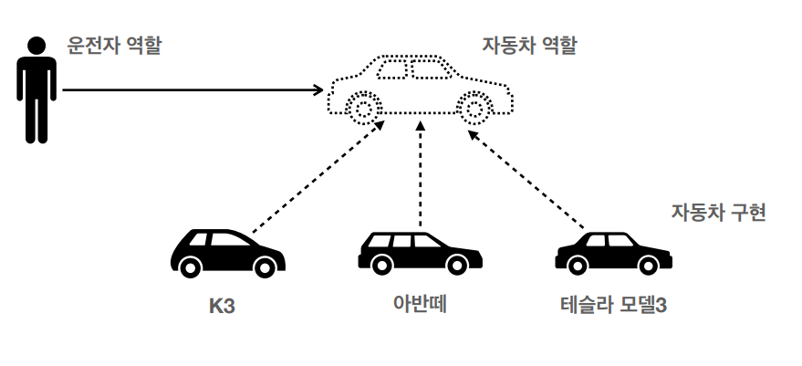
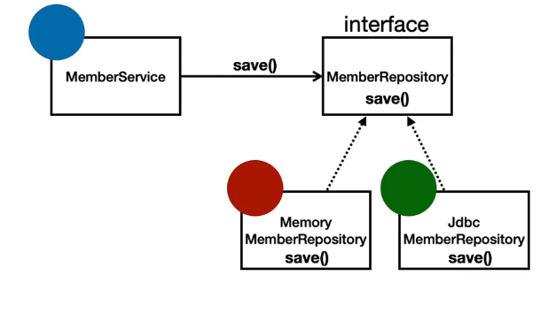
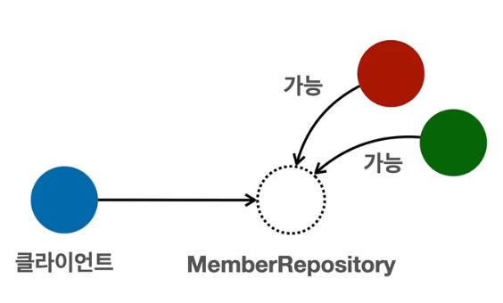
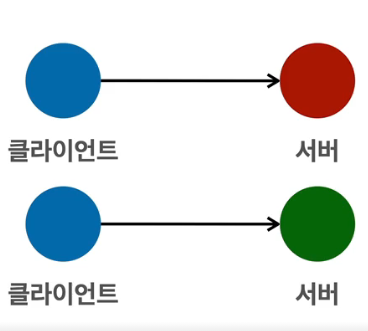
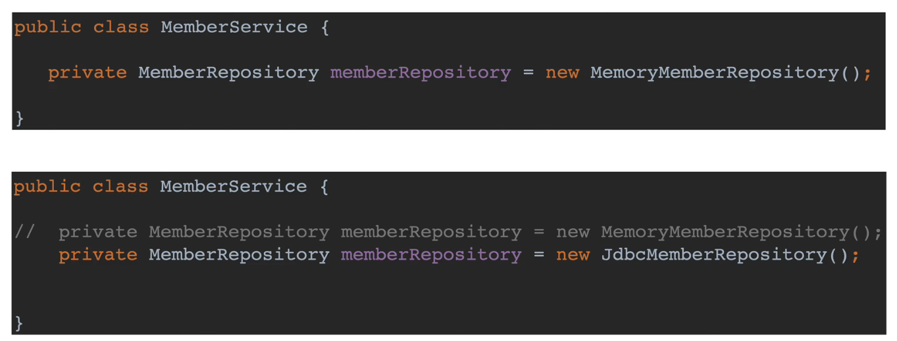

# 객체 지향 설계와 스프링

## 목차

+ [스프링 프레임워크](#스프링-프레임-워크)
+ [스프링 부트](#스프링-부트)
+ [스프링 단어](#스프링-단어)
+ [스프링의 진짜 핵심](#스프링의-진짜-핵심)
+ [객체 지향 특징](#객체-지향-특징)
+ [다형성](#다형성)
+ [스프링과 객체 지향](#스프링과-객체-지향)
+ [좋은 객체 지향 설계의 5가지 원칙(SOLID)](#좋은-객체-지향-설계의-5가지-원칙(SOLID))
+ [총정리](#총정리)

---

##  스프링 프레임 워크

+ 핵심 기술 : 스프링 DI 컨테이너 , AOP, 이벤트 , 기타 
+ 웹 기술 : 스프링 MVC, 스프링 WebFlux
+ 데이터 접근 기술 : 트랜잭션, JDBC, ORM 지원, XML 지원
+ 기술 통합 : 캐시, 이메일, 원격접근, 스케줄링
+ 테스트 : 스프링 기반 테스트 지원
+ 언어 : 코틀린 그루비

최근 스프링 부트를 통해 스프링 프레임워크의 기술들을 편리하게 사용

---

## 스프링 부트

+ 스프링을 편리하게 사용할 수있도록 지원, 기본으로 사용
+ Tomcat 같은 웹서버 설치 X
+ 손쉬운 빌드 구성을 위한 starter 종속성 제공
+ 스프링과 3rd path(외부) 라이브러리 자동 구성
+ 메트릭, 상태 확인, 외부 구성 같은 프로덕션 준비기능 제공
+ 관례에 의한 간결한 설정

---

## 스프링 단어

+ 스프링 DI 컨테이너 기술
+ 스프링 프레임워크
+ 스프링 부트, 스프링 프레임워크 등 모두를 포함한 스프링 생태계

---

## 스프링의 진짜 핵심

+ 자바 언어 기반의 프레임워크
+ 객체 지향 언어
+ 객체 지향 언어가 가진 강력한 특징을 살려내는 프레임워크
+ 좋은 객체 지향 애플리케이션을 개발할 수 있게 도와주는 프레임워크

---

## 객체 지향 특징

+ 추상화
+ 상속
+ 캡슐화
+ 다형성

---

## 다형성

**<span style="color:rgb(255, 0, 0)">역할과 구현</span>** 으로 세상을 구분



위와 같이 자동차라는 **<span style="color:rgb(255, 0, 0)">구현이 바뀌더라도</span>** 운전자 역할 **<span style="color:rgb(255, 0, 0)">(운전할 수 있는 능력) 이 바뀌지않는다.</span>** <br>
이게 제일중요한 다형성의 특징이다.

이렇게 한 이유는 운전자 역할을 위해서이다.

**"운전자 역할 = 클라이언트"** 라고 생각하면되는데, 해당 클라이언트가 자동자의 내부를 알 필요가없다.<br>
클라이언트는 운전할 능력만 있으면되는거지, 그 내부에 구조가 어떤지 확인할 필요가없다.<br>
이는 자동차 구현을 무한하게 넓힐 수 있게된다.<br>

즉, 클라이언트에 영향을 안주고 새로운 기능을 구현할 수 있다.

+ 클라이언트는 대상의 역할(인터페이스) 만 알면 된다.
+ 클라이언트는 구현 대상의 내부 구조를 몰라도 된다.
+ 클라이언트는 구현 대상의 내부 구조가 변경되어도 영향을 받지 않는다.
+ 클라이언트는 구현 대상 자체를 변경해도 영향을 받지 않는다.

자바 언어에서는 <span style="color:rgb(0, 176, 80)">역할 = 인터페이스</span> , <span style="color:rgb(112, 48, 160)">구현 = 인터페이스를 구현한 클래스, 구현 객체</span>

객체를  설계할 때 역할과 구현을 명확히 분리

**<span style="color:rgb(255, 0, 0)">객체 설계시 역할(인터페이스)을 먼저 부여</span>** 하고, **<span style="color:rgb(0, 176, 240)">그 역할을 수행하는 구현 객체 만들어야함</span>**

### 객체의 관계부터 정립

+ 혼자 있는 객체는 없다
+ 클라이언트 : 요청, 서버 : 응답
+ 수 많은 객체 클라이언트 와 객체 서버는 서로 협력 관계를 가진다.

### 자바의 오버라이딩을 떠올려보자



간단한 예시로) <br>
Service 에서 MemberRepository 의 save() 함수를 호출하면 오버라이딩된 각 클래스의 save() 함수가 호출이된다.

### 클라이언트 / 서버 라고 생각하면된다.



MemberService 인 클라이언트가  MemberRepository 를 의존(DI)하고 <br>
MemberRepository 의 함수들을 호출시 해당 자식들의 함수를 호출할 수 있다.



### **<span style="color:rgb(255, 0, 0)">다형성의 본질</span>**

+ 인터페이스를 구현한 **<span style="color:rgb(112, 48, 160)">객체 인스턴스를 실행 시점에 유연하게 변경</span>** 할 수 있다.
+ 다형성의 본질을 이해하려면 **<span style="color:rgb(0, 176, 80)">협력이라는 객체사이의 관계에서 시작됨</span>**
+ 클라이언트를 변경하지 않고, **<span style="color:rgb(0, 176, 240)">서버의 구현 기능을 유연하게 변경할 수 있다.</span>**

**<span style="color:rgb(255, 0, 0)">역할과 구현을 분리</span>** 를 할 수 있다는 점에서 제일 중요하다.

+ 실세계의 역할과 구현이라는 편리한 컨셉을 다형성을 통해 객체 세상을 가져올 수 있음
+ 유연하고, 변경이 용이
+ 확장 가능한 설계
+ **<span style="color:rgb(180, 142, 173)">클라이언트에 영향을 주지 않는 변경 가능</span>**
+ **<span style="color:rgb(0, 176, 240)">인터페이스를 안정적으로 잘 설계</span>** 하는 것이 중요

MemberRepository 에 다른 서버를 사용하고싶으면 새로 개발한 서버를 넣어주기만 하면 가능하다.<br>
(Bean 에 등록시켜서 관리하면된다.)

※**<span style="color:rgb(255, 0, 0)">인터페이스를 안정적으로 설계하는 것이 중요하다</span>**

---

## 스프링과 객체 지향

+ 다형성이 가장 중요하다
+ 스프링은 다형성을 극대화해서 이용할 수 있게 도와준다.
+ 제어의 역전(IOC) , 의존관계 주입(DI) 등 편리하게 사용하도록 지원한다.
+ 레고를 조립하듯이 구현을 편리하게 변경이 가능하다.

## 좋은 객체 지향 설계의 5가지 원칙(SOLID)

+ SRP : 단일 책임 원칙 (single responsibility principle)
+ OCP : 개발-폐쇄 원칙 (Open/closed principle)
+ LSP : 리스코프 치환 원칙 (Liskov substitution principle)
+ ISP : 인터페이스 분리 원칙 (Interface segregation principle)
+ DIP : 의존관계 역전 원칙 (Dependency inversion principle)

### SRP 단일 책임 원칙 (single responsibility principle)

+ 한 클래스는 하나의 책임만 가져야한다
+ 하나의 책임이라는 것은 모호 할 수 있다.
+ 중요한 기준은 변경이다. 변경을 했을시 파급효과가 적으면 단일 책임 원칙을 잘 따른것
+ UI 변경, 객체의 생성과 사용을 분리

### OCP  개발-폐쇄 원칙 (Open/closed principle)

+ **<span style="color:rgb(255, 0, 0)">확장에는 열려</span>** 있으나 **<span style="color:rgb(180, 142, 173)">변경에는 닫혀</span>** 있어야한다.



변경에는 닫혀있어야하는데 변경에 열려있다.

문제점 : 구현체를 바꾸는데 있어서 클라이언트에서 코드를 수정해야됨

+ 분명 다형성을 사용했지만 OCP 원칙을 지킬 수 가 없다.

이를 해결법은 "설정자"가 필요하다 이는 Spring Container(Configuration)이 해결해준다.

### LSP  리스코프 치환 원칙 (Liskov substitution principle)

+ 프로그램의 객체는 프로그램의 정확성을 깨뜨리지 않으면서 하위 타입의 인스턴스로 바꿀 수 있어야한다.
+ 다형성에서 하위 클래스는 인터페이스 규약을 다 지켜야 한다는 것, 다형성을 지원하기 위한 원칙,
  인터페이스를 구현한 구현체를 믿고 사용하려면, 이원칙이 필요하다
+ 단순히 컴파일에 성공하는 것을 넘어서는 이야기
+ 예) 자동차 인터페이스의 엑셀은 앞으로 가라는 기능, 뒤로 가게 구현하면 LSP 위반, 느리더라도 앞으로 가야됨

즉, **<span style="color:rgb(255, 0, 0)">규정된 규칙들은 따라야한다.</span>**

### ISP  인터페이스 분리 원칙 (Interface segregation principle)

+ 특정 클라이언트를 위한 인터페이스 여러개가 범용 인터페이스 하나보다 낫다
+ 자동차 인터페이스 -> 운전 인터페이스, 정비 인터페이스로 분리
+ 사용자 클라이언트 -> 운전자 클라이언트, 정비사 클라이언트로 분리
+ 분리하면 정비 인터페이스 자체가 변해도 운전자 클라이언트에 영향을 주지않는다.
+ 인터페이스가 명확해지고, 대체 가능성이 높아진다.

즉, 여러 인터페이스로 나눴을 경우 장비 인터페이스가 변해도 운전자 클라이언트가 변하지않는다.

### DIP 의존관계 역전 원칙 (Dependency inversion principle)

+ **"<span style="color:rgb(255, 0, 0)">추상화에 의존해야하지, 구체화에 의존하면 안된다</span>"**
+ 구현 클래스에 의존하지 말고, **<span style="color:rgb(0, 176, 80)">인터페이스에 의존</span>** 해야된다.
+ 앞에서 역할과 구현에서 **<span style="color:rgb(180, 142, 173)">역할(Role)</span>** 에 의존하게 해야 한다는 것과 같다

```java
private MemberRepository memberReopsitory = new MemoryMemberRepository();

```

해당 코드를 살펴보면 MemberRepository 는 결국 MemoryMemberRepository 를 같이 의존하고있다.<br>
그래서 MemoryMemberRepository 인 구현체를 다른 구현체로 바꿀때<br>
**<span style="color:rgb(255, 0, 0)">클라이언트인 (MemberService) 에서 수정해야되는 대참사가 발생</span>** 하고있는 것이다.<br>

### 정리)

+ 객체 지향의 핵심은 다형성
+ 다형성 만으로는 쉽게 부품을 갈아 끼우듯이 개발할 수 없다
+ 다형성 만으로는 구현 객체를 변경할 때 클라이언트 코드도 함께 변경된다
+ 다형성 만으로는 OCP, DIP를 지킬 수 없다 <- 이걸 Spring boot 가 해결해준다 ㅋㅋ

### 스프링

+ 스프링은 다음 기술로 **<span style="color:rgb(255, 0, 0)">다형성 + OCP, DIP를 가능하게 지원</span>**
    + DI : 의존 관계, 의존성 주입
    + DI 컨테이너 제공
+ 클라이언트 코드의 변경 없이 기능 확장
+ 쉽게 부품을 교체하듯이 개발

## 총정리

+ 모든 설계에서 역할과 구현을 분리해야된다.
+ 이상적으로 모든 설계에 인터페이스를 부여하자

### **<span style="color:rgb(180, 142, 173)">실무 고민</span>**

+ 인터페이스를 도입하면 추상화라는 비용이 발생한다.
+ 기능을 확장할 가능성이 없다면, 구체 클래스를 직접 사용하고, 향후 꼭 필요할 때 리팩터링해서 인터페이스를 도입하는 것도 방법이다.