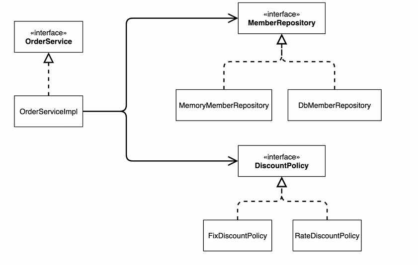

# 객체 지향 원리 (색션 3 ~ 색션 4)

### [스프링 기본편 돌아가기](../README.md)

## 정리 목록

**핵심원리 이해 1 (예제 만들기) ~ 핵심원리 이해 2 (객체지향 원리 적용)**

## 목차

+ [비즈니스 요구사항과 설계](#비즈니스-요구사항과-설계)
+ [회원 도메인 설계](#회원-도메인-설계)
+ [도메인 실행과 테스트](#도메인-실행과-테스트)
+ [주문 할인 도메인](#주문-할인-도메인)
+ [현재의 문제점](#현재의-문제점)
+ [AppConfig](#AppConfig-등장)
+ [새로운 할인 정책 개발](#새로운-할인-정책-개발)
+ [전체 흐름](#전체-흐름)
+ [좋은 객체 지향 설계 (5가지)](#좋은-객체-지향-설계-5가지)
+ [IOC,DI 그리고 컨테이너](#iocdi-그리고-컨테이너)
+ [스프링으로 전환하기](#스프링으로-전환하기)

---

## 비즈니스 요구사항과 설계

+ 회원
    + 회원을 가입하고 조회할 수 있다.
    + 회원은 일반과 VIP 두 가지 등급이 있다.
    +  회원 데이터는 자체 DB를 구축할 수 있고, 외부 시스템과 연동할 수 있다. (미확정)
+ 주문과 할인 정책
    + 회원은 상품을 주문할 수 있다.
    + 회원 등급에 따라 할인 정책을 적용할 수 있다.
    + 할인 정책은 모든 VIP 는 1000원을 할인해주는 고정 금액 할인을 적용해달라. (나중에 변경 될 수 있다.)
    + 할인 정책은 변경 가능성이 높다. 회사의 기본 할인 정책을 아직 정하지 못했고, 오픈 직전까지 고민을 미루 고 싶다. 최악의 경우 할인을 적용하지 않을 수 도 있다. (미확정)

[목차로 돌아가기](#목차)

---

## 회원 도메인 설계

+ 회원 도메인 요구 사항
    + 회원은 일반과 VIP 두 가지 등급이 있다.
    + 회원 데이터는 자체 DB 를 구축할 수 있고, 외부 시스템과 연동할 수 있다. (미확정)

### 회원 도메인 협력 관계


### 회원 클래스 다이어그램


### 회원 객체 다이어그램


+ 회원 서비스 : "MemberServiceImpI"

[목차로 돌아가기](#목차)

---

## 도메인 실행과 테스트

확인 테스트 : **"<span style="color:rgb(255, 0, 0)">넣은 값과 찾는 값이 같은지 확인</span>"**<br>
문제가 없으면 녹색으로 검증이 완료된다.

이때 Assertions 는 (org.assertj.core.api) 를 가져가야 편하게 확인이 가능하다.<br>

```java
class MemberServiceTest {  
  
    MemberService memberService = new MemberServiceImpl();  
  
    @Test  
    void join(){  
        // given  
        Member member = new Member(1L,"memmberA",Grade.VIP);  
  
        // when  
        memberService.join(member);  
        Member findMember = memberService.findMember(1L);  
  
        //then  
        Assertions.assertThat(member).isEqualTo(findMember);  
    }  
}
```

### 문제점

순수 자바코드로 작성했을때 **<span style="color:rgb(180, 142, 173)">SOLID 5원칙중 OCP, DIP 원칙을 위반</span>** 하고있다.<br>
추상화에 구현까지 의존하고있기에 **<span style="color:rgb(255, 0, 0)">만약 DB를 바꿀시 해당 코드를 수정해야되는 문제점</span>** 이 생긴다.<br>

```java
public class MemberServiceImpl implements MemberService{  
  
    private final MemberRepository memberRepository = new MemoryMemberRepository();  
    @Override  
    public void join(Member member) {  
        memberRepository.save(member);  
    }  
  
    @Override  
    public Member findMember(Long memberId) {  
        return memberRepository.findById(memberId);  
    }  
}
```

[목차로 돌아가기](#목차)

---

## 주문 할인 도메인

클라이언트가 주문을 요청하면 **<span style="color:rgb(255, 0, 0)">주문 서비스가 회원 정보</span>** 와 **<span style="color:rgb(255, 0, 0)">회원 정책을 통해 주문 결과를 반환</span>** 을 해준다.

---

### 주문 도메인 전체


---

### 주문 도메인 클래스 다이어그램



---

### 주문 도메인 객체 다이어그램1


### 정리)

클라이언트가 주문을 하면 <span style="color:rgb(255, 0, 0)">주문서비스 구현체에서 회원 정보와 할인정책을 가지고 반환값</span>을 넘겨준다.

### Discount Repository

```java 
public interface DiscountPolicy {  
  
    // 할인 대상 금액  
    int discount(Member member, int price);  
}
```
---

### Discount 구현체 (무조건 1000원 할인)

```java
public class FixDiscountPolicy implements DiscountPolicy{  
  
    private int discountFixAmount = 1000; // 1000원 할인  
    @Override  
    public int discount(Member member, int price) {  
  
        // Enum 은 == 타입이다.  
        if(member.getGrade() == Grade.VIP){  
            return discountFixAmount;  
        }  
        else{  
            return 0;  
        }  
    }  
}
```

Discount Repository를 통해 할인 기능을 만들어놓고 상속받은 구현체가 구현을 해준다.

1. <span style="color:rgb(180, 142, 173)">무조건 천원 할인</span>
2. <span style="color:rgb(180, 142, 173)">정률 할인</span>

이렇게 두가지를 구현을 해줘야한다.
이후에 주문 엔티티가 필요하다

주문을 어떻게 받을 지 구현체가 필요하다

---

### 주문 엔티티

주문 엔티티를 통해  물건 번호, 물건 이름, 물건 가격, 할인율 을 저장하고 데이터를 꺼내서 사용한다.<br>

```java
public class Order {  
  
    private Long memberId; // 물건 번호  
    private String itemName; // 물건 이름  
    private int itemPrice; // 물건 가격  
    private int discountPrice; // 할인율  
  
    public Order(Long memberId, String itemName, int itemPrice, int discountPrice) {  
        this.memberId = memberId;  
        this.itemName = itemName;  
        this.itemPrice = itemPrice;  
        this.discountPrice = discountPrice;  
    }  
  
    public int calculatePrice(){  
        return itemPrice - discountPrice;  
    }  
  
    public void setMemberId(Long memberId) {  
        this.memberId = memberId;  
    }  
  
    public void setItemName(String itemName) {  
        this.itemName = itemName;  
    }  
  
    public void setItemPrice(int itemPrice) {  
        this.itemPrice = itemPrice;  
    }  
  
    public void setDiscountPrice(int discountPrice) {  
        this.discountPrice = discountPrice;  
    }  
  
    public Long getMemberId() {  
        return memberId;  
    }  
  
    public String getItemName() {  
        return itemName;  
    }  
  
    public int getItemPrice() {  
        return itemPrice;  
    }  
  
    public int getDiscountPrice() {  
        return discountPrice;  
    }  
      
    // 출력시 내용 보여주기  
    @Override  
    public String toString() {  
        return "Order{" +  
                "memberId=" + memberId +  
                ", itemName='" + itemName + '\'' +  
                ", itemPrice=" + itemPrice +  
                ", discountPrice=" + discountPrice +  
                '}';  
    }  
}
```

---

### Order Repository

주문 인터페이스를 만들고 구현화를 해주면된다.<br>
주문 엔티티에 실제적으로 저장하고 값을 꺼내서 사용할 수 있게 구현화가 필요하다<br>

```java
public interface OrderService {  
    Order createOrder(Long memberId,String itemName, int itemPrice);  
}
```

---

### OrderService 구현

OrderService 인터페이스를 상속 받고 주문 엔티티에 회원 정보, 해당 회원 할인율을 저장한 값을 반환<br>

```java
public class OrderServiceImpl implements OrderService{  
  
    // 회원 정보 조회  
    private final MemberRepository memberRepository = new MemoryMemberRepository();  
    // 할인 내역 (고정 할인)  
    private final DiscountPolicy discountPolicy = new FixDiscountPolicy();  
  
  
    @Override  
    public Order createOrder(Long memberId, String itemName, int itemPrice) {  
        Member member = memberRepository.findById(memberId);  
        int discountPrice = discountPolicy.discount(member, itemPrice);  
  
        return new Order(memberId,itemName,itemPrice,discountPrice);  
    }  
}
```

---

### 주문 테스트

Test 결과를 통해 "<span style="color:rgb(255, 0, 0)">해당 회원의 할인율과 설정한 할인율이 같은지</span>" 확인<br>

```java
public class OrderServiceTest {  
  
    MemberService memberService = new MemberServiceImpl();  
    OrderService orderService = new OrderServiceImpl();  
  
    @Test  
    void createOrder(){  
        Long memberId = 1L;  
        Member member = new Member(memberId, "memberA", Grade.VIP);  
        memberService.join(member);  
  
        Order order = orderService.createOrder(memberId, "itemA", 10000);  
  
        Assertions.assertThat(order.getDiscountPrice()).isEqualTo(1000);    
    }  
}
```
[목차로 돌아가기](#목차)

---

## 현재의 문제점

현 문제점 : SOLID 5원칙중 DIP, OCP 문제점으로 인해 구현체를 바꿀시 클라이언트를 바꿔야한다.<br>
클라이언트가 추상화(인터페이스)<br>

OCP : **<span style="color:rgb(180, 142, 173)">확장에는 열려있지만 변경에는 닫혀있어야한다.</span>** <br>
DIP : **<span style="color:rgb(180, 142, 173)">추상화에 의존해야지, 구현에 의존하면안된다.</span>** <br>

두가지 원칙을 위반하고있다.<br>
이를 해결하는 법은 "**<span style="color:rgb(255, 0, 0)">외부에서 각역할에 해당되는 구현체를 설정과 수정을 할 수 있게끔 해주면된다</span>**"<br>
즉, **<span style="color:rgb(0, 176, 80)">IOC 컨테이너</span>**, 혹은 **<span style="color:rgb(0, 176, 80)">DI(Dependency Injection) 컨테이너</span>** 라고한다.<br>

### 기대했던 의존관계


### 실제 의존관계


해당 코드처럼 추상화와 구현을 둘다 의존하기에 DIP, OCP 를 위반하고있다.

```java
private final DiscountPolicy discountPolicy = new FixDiscountPolicy();
```

이걸 다른 구현체인 RateDiscountPolicy 로 바꾸고싶다면 이와같이 변경해야된다.

```java
private final DiscountPolicy discountPolicy = new RateDiscountPolicy();
```

이는 앞서서 봤던 OCP 위반이기때문에 다른 방법을 사용해야된다.

---

### 변경된 의존관계


※ 역할에만 의존하게끔 설정해놓으면 구현이 어떻게 바뀌든 상관없게끔 변경해야된다.<br>
(모르도록)

---

### 원하는 의존관계


즉, <span style="color:rgb(255, 0, 0)">관심사를 분리해야된다</span>.<br>
한 예시로 배우는 본인의 역할인 배역을 수행하는 것에만 집중해야된다.<br>
배우가 특정 배우를 지정해서 하는것이아닌 어떤 사람이 오더라도 문제없이 해결할 수 있어야한다.<br>

**<span style="color:rgb(180, 142, 173)">로직에만 충실</span>** 해야된다. <br>
**<span style="color:rgb(0, 176, 80)">배우를 설정하고 의존관계를 주입하는건 기획자가 하는것</span>** 이다.

[목차로 돌아가기](#목차)

---

## AppConfig 등장

AppConfig 를 통해 기획자가 어떤 배우를 할지 설정을 해준다.<br>
외부에서 한파일로 의존 관계를 주입을 해준다.<br>

```java
public class AppConfig {  
    // AppConfig 리팩토링  
    // memberRepository DI  
    public MemoryMemberRepository memberRepository() {  
        return new MemoryMemberRepository();  
    }  
    // discountPolicy DI  
    public DiscountPolicy discountPolicy(){  
      // return new FixDiscountPolicy();  
        return new RateDiscountPolicy();  
    }  
      
    // memberService DI  
    public MemberService memberService(){  
        return new MemberServiceImpl(memberRepository());  
    }  
  
    // orderService DI  
    public OrderService orderService(){  
        return new OrderServiceImpl(memberRepository(), discountPolicy());  
    }  
}
```

### 예시)

MemberRepository 를 구현한 MemoryMemberRepository 는 MemberServiceImpl 에서 사용을한다.

---

#### MemberServiceImpl

근데 MemberServiceImpl 입장에서는 MemberRepository 를 알뿐 해당 구현체인MemoryMemberRepository 를 알수가없다.<br>

```java
public class MemberServiceImpl implements MemberService{  
  
    private final MemberRepository memberRepository;  
  
    public MemberServiceImpl(MemberRepository memberRepository) {  
        this.memberRepository = memberRepository;  
    }  
    @Override  
    public void join(Member member) {  
        memberRepository.save(member);  
    }  
  
    @Override  
    public Member findMember(Long memberId) {  
        return memberRepository.findById(memberId);  
    }  
}
```

---

#### MemberServiceImpl 를 사용하는 main()을 알아보자

여기서 보면 AppConfig 에서 만들어놓은 해당 MemberService 의 해당 구현체에 <br>
"return new MemberServiceImpl(memberRepository()); " 를 던져줘서 의존성을 주입해줬다.<br>
만약 MemberServiceImpl() <- 구현체가 변할시 해당 코드만 수정하면 다른 수정없이 해결이 가능하다.<br>

```java
public class MemberApp {  
  
    public static void main(String[] args) {  
        AppConfig appConfig = new AppConfig();  
        MemberService memberService = appConfig.memberService();  
  
        //MemberService memberService = new MemberServiceImpl();  
        Member member = new Member(1L, "memberA", Grade.VIP);  
        memberService.join(member);  
  
        Member findMember = memberService.findMember(1L);  
        System.out.println("new member = " + member.getName());  
        System.out.println("find Member = " + findMember.getName());  
    }  
}
```

---

### 그림 - 클래스 다이어그램

그림으로 확인해보면 AppConfig는 각 인터페이스에 구현체를 의존을 해주고있다.<br>
여기서 중요한건 MemberServiceImpl 입장에서는 구현체에 대해선 <br>
모르고 인터페이스만 알고있다는 사실이다.


---

### 전체적인 흐름

우리가 기대한 큰 흐름에서 AppConfig 덕분에 해결이 가능하다.


[목차로 돌아가기](#목차)

---

## 새로운 할인 정책 개발

기존 1000원 할인 되는걸  10% 할인되게끔 새로운 구현체 구현<br>

```java
public class RateDiscountPolicy implements DiscountPolicy{  
  
    private int discountPercent = 10;  
    @Override  
    public int discount(Member member, int price) {  
        if(member.getGrade() == Grade.VIP){  
            return price * discountPercent / 100;  
        }  
        else{  
            return 0;  
        }  
    }  
}
```

새로 구현한 구현체를 AppConfig 에 적용시키면된다.

---

### AppConfig

기존 구현된 DI 컨테이너에서 DiscountPolicy 부분만 수정해주면된다.

```java  
public class AppConfig {  
    // AppConfig 리팩토링  
    // memberRepository DI  
    public MemoryMemberRepository memberRepository() {  
        return new MemoryMemberRepository();  
    }  
    // discountPolicy DI  
    public DiscountPolicy discountPolicy(){  
      // return new FixDiscountPolicy();  
        return new RateDiscountPolicy();  << 이부분에 새로 만든 구현체를 바꿔주면 끝!
    }  
      
    // memberService DI  
    public MemberService memberService(){  
        return new MemberServiceImpl(memberRepository());  
    }  
  
    // orderService DI  
    public OrderService orderService(){  
        return new OrderServiceImpl(memberRepository(), discountPolicy());  
    }  
}
```

그림으로 살펴보자

### 새로운 구현체 구현시 (기대한 의존관계 적용)

AppConfig 덕분에 우리가 기대한 의존관계가 형성되었다


[목차로 돌아가기](#목차)

---

## 전체 흐름

+ 새로운 할인 정책 개발
+ 새로운 할인 정책 적용과 문제점
+ 관심사의 분리
+ AppConfig 리팩터링

### 새로운 할인 정책 개발

다형성 덕분에 할인 정책을 개발하는것 자체는 문제가 없었다.

### 새로운 할인 정책적용과 문제점

구현체를 적용할려니 클라이언트 코드인 주문서비스 구현체도 수정해야된다

```java
private final DiscountPolicy discountPolicy = new FixDiscountPolicy();
```

**<span style="color:rgb(255, 0, 0)">!!! DIP 위반 위반</span>**

---

### 관심사의 분리

지금 현재 "배우가 배우 지정, 배우 역할 수행"을 통해 다양한 책임을 가지고 있다.<br>
그래서 이 책임을 담당하는 별도의 기획자가 필요하다.<br>
배우는 배우의 역할인 배역에만 집중해야되며, 다른것에 대해 책임을 질 필요가없다.<br>

이를 해결하는 기획자인 AppConfig 를 만들었고,<br>
이는 **<span style="color:rgb(180, 142, 173)">전체적인 동작방식을 구성</span>** 하기 위해 **<span style="color:rgb(255, 0, 0)">구현 객체를 생성하고 연결하는 책임</span>** 을 만들어 준다.

### AppConfig 리팩터링

구성 정보에서도 역할과 구현을 명확하게 분리해야된다.

[목차로 돌아가기](#목차)

---

## 좋은 객체 지향 설계 5가지

### SRP 단일 책임 원칙

한 클래스는 하나의 책임만 가져야한다.

+ SRP 단일 책임 원칙을 따르면서 관심사를 분리한다.
### DIP 의존관계 역전 원칙

"<span style="color:rgb(255, 0, 0)">추상화에 의존해야되고 구체화에 의존하면 안된다.</span>"

+ AppConfig 를 통해 객체 인스턴스를 클라이언트 코드 대신 생성해서 클라이언트 코드에 의존관계 주입

### OCP

"<span style="color:rgb(255, 0, 0)">확장에는 열려있으나 변경에는 닫혀있어야한다</span>."

+ 소프트웨어 요소를 새롭게 확장해도 사용 영역(클라이언트 영역)의 변경은 닫혀있다.

[목차로 돌아가기](#목차)

---

## IOC,DI 그리고 컨테이너

### 제어의 역전 IoC(Inversion of Control)

클라이언트 구현 객체가 필요한 서버에 구현객체를 생성하고 이를 개발자가 스스로 흐름을 조정했다.<br>
반면 AppConfig 가 등장 이후에는 구현 객체는 자신의 로직에만 집중하고 흐름을  AppConfig 를 통해 조정한다.<br>

이렇게 외부에서 흐름을 조정해주는걸 제어의 역전(IoC) 이라고 한다.

---

### 프레임워크 vs 라이브러리

+ 프레임워크가 내가 작성한 코드를 제에하고, 대신 실행하는 것
+ 내가 작성한 코드를 직접 제어의 흐름을 담당하는것을 라이브러리 라고한다.

---

### 의존관계 주입 DI(Dependency Injection)

+ 의존관계는 <span style="color:rgb(255, 0, 0)">정적인 클래스 의존 관계</span>와 <span style="color:rgb(0, 176, 240)">실행 시점에 결정되는 동적인 객체(인스턴스) 의존관계</span>를 분리해서 생각해야된다.

---

### 정적 클래스 다이어그램


### 동적인 객체 인스턴스 의존관계

애플리케이션 실행 시점에 실제 생성된 객체 인스턴스의 참조가 연결된 의존관계이다

---

### 객체 다이어그램

 <br>

+ 애플리케이션 <span style="color:rgb(255, 0, 0)">실행 시점(런타임)</span>에 외부에서 실행 구현 객체를 생성하고 클라이언트에 전달해서
  <span style="color:rgb(0, 176, 80)">클라이언트와 서버의 실제 의존관계가 연결되는 것</span>을 <span style="color:rgb(0, 176, 240)">의존관계 주입</span>이라한다.

### IoC 컨테이너, DI 컨테이너

+ AppConfig 처럼 객체를 생성하고 관리하면서 의존관계를 연결해 주는 것
+ <span style="color:rgb(255, 0, 0)"> IoC 컨테이너</span> 또는<span style="color:rgb(255, 0, 0)"> DI 컨테이너</span>라고 한다.

[목차로 돌아가기](#목차)

---

## 스프링으로 전환하기

@Configuration 을 통해 스프링 컨테이너에 각 의존관계를 @Bean 으로 등록시킨다. <br>
이렇게 사용했을 시, 스프링 컨테이너를 통해  의존관계를 객체 생성없이 해결이 가능하다.

```java
@Configuration  
public class AppConfig {    
    @Bean  
    // memberRepository DI  
    public MemoryMemberRepository memberRepository() {  
        return new MemoryMemberRepository();  
    }  
  
    @Bean  
    // discountPolicy DI  
    public DiscountPolicy discountPolicy(){  
      // return new FixDiscountPolicy();  
        return new RateDiscountPolicy();  
    }  
  
    @Bean  
    // memberService DI  
    public MemberService memberService(){  
        return new MemberServiceImpl(memberRepository());  
    }  
  
    @Bean  
    // orderService DI  
    public OrderService orderService(){  
        return new OrderServiceImpl(memberRepository(), discountPolicy());  
    }  
}
```

의존 관계를 정리한 class 를 객체로 생성해서 주입을 해줘야했다.

---

```java
AppConfig appConfig = new AppConfig();  
MemberService memberService = appConfig.memberService(); 
OrderService orderService = appConfig.orderService();         

```

하지만 @Configuration 과 @Bean 을 통해 스프링 컨테이너에 Bean 을 등록한걸 가져와서 사용하게끔 변경

---

```java
public class OrderApp {  
  
    public static void main(String[] args) {  
        ApplicationContext applicationContext = new 
		        AnnotationConfigApplicationContext(AppConfig.class);  
		        
        MemberService memberService = applicationContext.
        getBean("memberService", MemberService.class);  
        OrderService orderService = applicationContext.
        getBean("orderService", OrderService.class);  
    }  
}
```
[목차로 돌아가기](#목차)